background-image: url(https://upload.wikimedia.org/wikipedia/commons/b/be/Sharingan_triple.svg)

```{r setup, include=FALSE}
options(htmltools.dir.version = FALSE)
library(xaringanthemer)
#xaringan::inf_mr()
style_duo_accent(primary_color = "#1381B0", 
                 secondary_color = "#4a4947",
                 link_color= "#009E73",
                 code_inline_font_size = "2em",
                 colors = c(
                   red = "#f34213",
                   pink ="#CC79A7",
                   purple = "#BBA9E2",
                   orange = "#ff8811",
                   green = "#009E73",
                   white = "#FFFFFF"))


library(knitr)
library(fontawesome)
library(tidyverse)
library(GGally)
library(plotly)
```

???

Image credit: [Wikimedia Commons](https://commons.wikimedia.org/wiki/File:Sharingan_triple.svg)

---
class: center, middle

# Welcome to the new programming world

 
<iframe width="800" height="440" src="https://www.youtube.com/embed/Ru5fQZ714x8?controls=0&amp;start=2" frameborder="0" allow="accelerometer; autoplay; encrypted-media; gyroscope; picture-in-picture" allowfullscreen></iframe>

---

class: inverse, center, middle

##  “Learning to write programs stretches your mind, and helps you think better, creates a way of thinking about things that I think is helpful in all domains.” -  Bill Gates

---


# How to get started 

--

- Choose a program most relevant to you study or work

--

- Install it on your computer 

--

- Start using it in anything you can think of (even as a calculator)

--

- Then...

--

- `r emo::ji("rocket")` `r emo::ji("rocket")` `r emo::ji("rocket")`


---
# Important things to consider 

- Which program package is most relevant to your work and study

--

- How strong are your motivations 

--

- Level of support you have to learn and use the program 

--

- The cost-effectiveness of learning should never be a concern

---

## Why use R ?

```{r,echo=FALSE,out.width="80%",fig.align="center"}
# All defaults
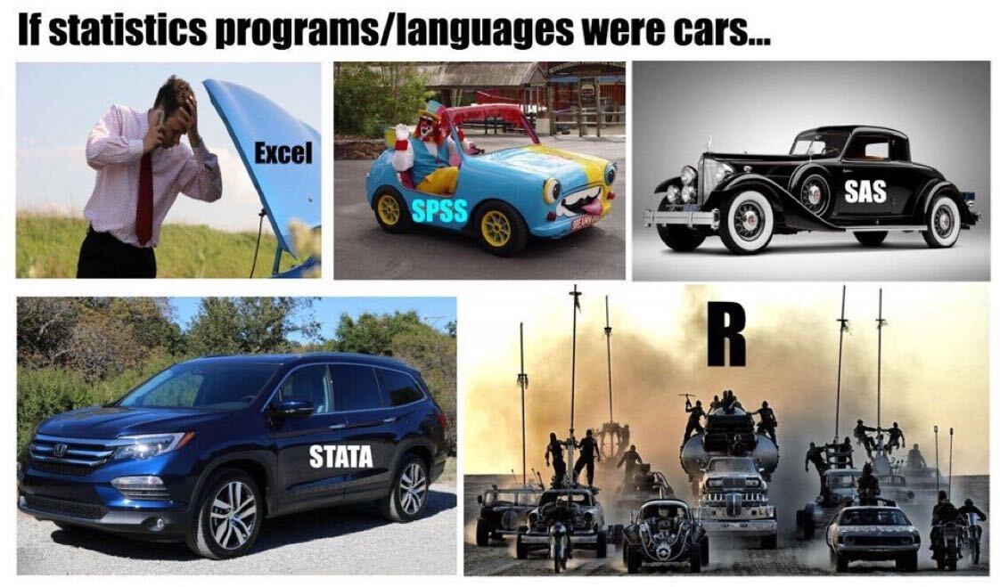
```

---


.flex[
.w-50.center[


```{r,echo=FALSE,out.width="95%",fig.align="center"}
# All defaults
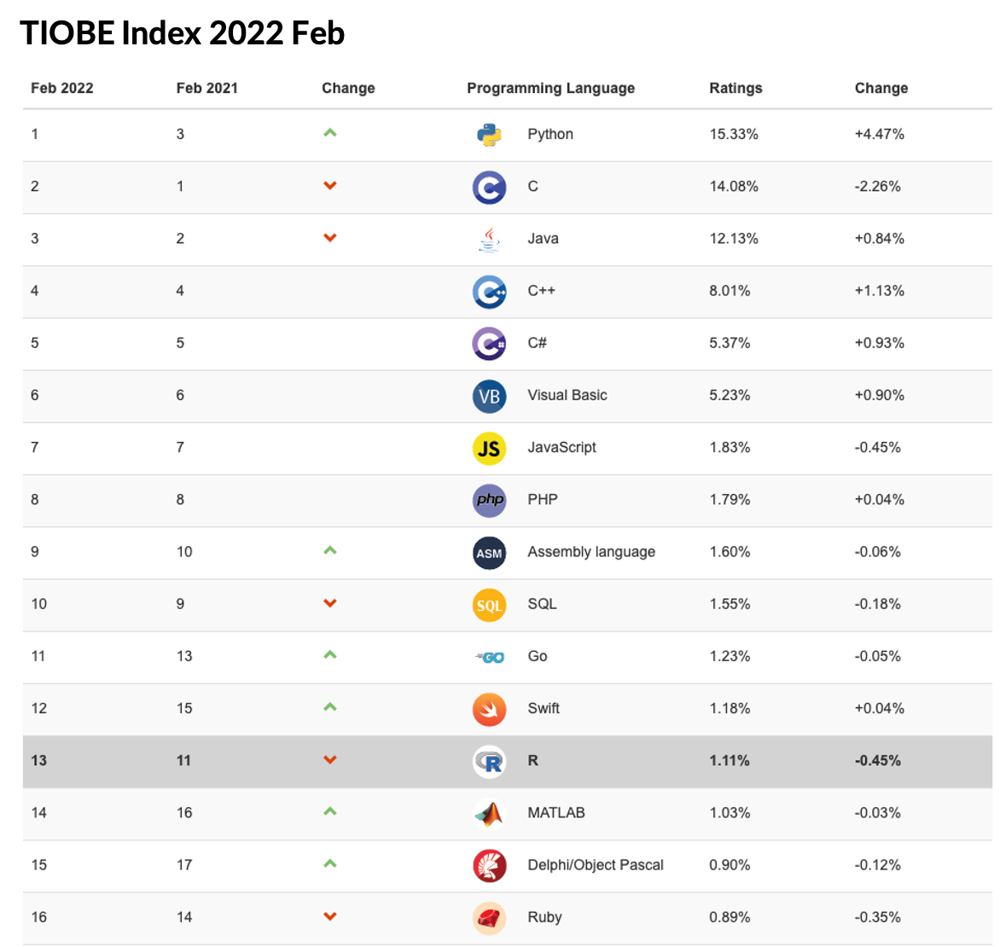
```
]
.w-50.center[

```{r,echo=FALSE,out.width="100%"}
# All defaults
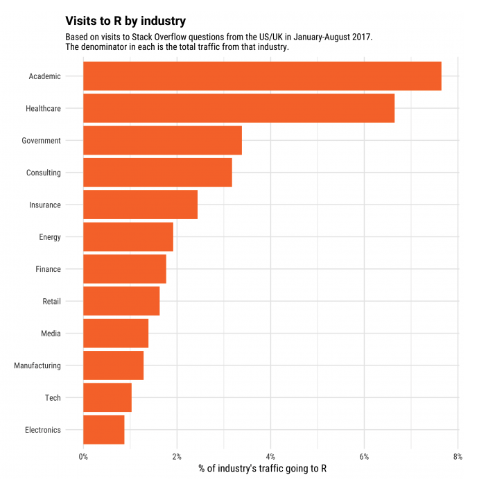
```

]
]


---

class: inverse, center, middle


## Practically, you can 
--

## **.purple[efficiently]** achieve almost **.purple[everything]** using R 
--

## in research 
--

## with assistance from other tools 


---
## Study design 

Experimental design (e.g, experiments, dose-response studies, clinical trails etc.)

Power calculation and sample size estimation 

Random allocation, matching and simulation


.small[[CRAN Task View: Design of Experiments (DoE) & Analysis of Experimental Data](https://cran.r-project.org/web/views/ExperimentalDesign.html)]

.small[[CRAN Task View: Clinical Trial Design, Monitoring, and Analysis](https://cran.r-project.org/web/views/ClinicalTrials.html)]

---

```{r,echo=FALSE,out.width="80%"}
# All defaults
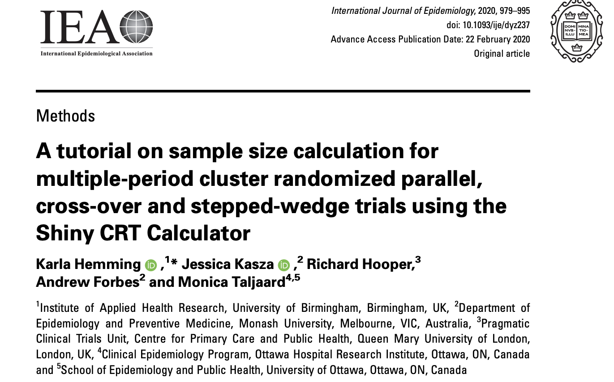
```
.small[https://clusterrcts.shinyapps.io/rshinyapp/]

---
## Systematic review 
.flex[
.w-80[
```{r,echo=FALSE,out.width="100%"}
# All defaults
knitr::include_graphics("graphics/reviews.png")
```
```{r,echo=FALSE,out.width="70%"}
# All defaults
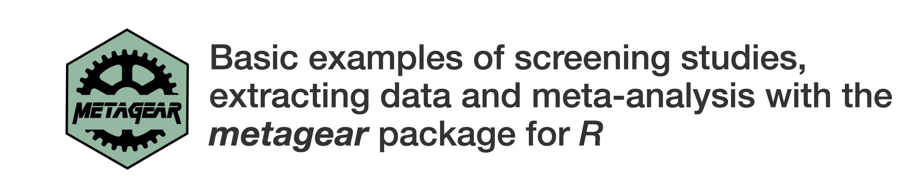
```
]

.w-20.center[

<br> <br>
.small[ [revtools](https://revtools.net/screening.html#manual-screening)]
<br> <br> <br> <br> <br> <br>  

.small[ [metagear](http://lajeunesse.myweb.usf.edu/metagear/metagear_basic_vignette.html#generating-different-prisma-plot-layouts)]
]
]

---
## Data collection 

```{r,echo=FALSE,out.width="80%"}
# All defaults
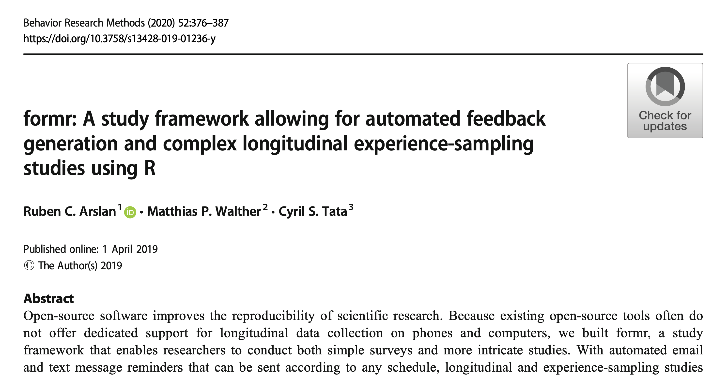
```
.small[https://link.springer.com/content/pdf/10.3758/s13428-019-01236-y.pdf]

---
## formr

.flex[
.w-40.center[

```{r,echo=FALSE,out.width="88%",fig.align="center"}
# All defaults

```
]
.w-20.center[

<br><br><br>

.font300[`r fa("plus", fill = "black")`]

]

.w-40.center[

```{r,echo=FALSE,out.width="70%"}
# All defaults

```

.font150[OpenCPU]
]
]

---


```{r,echo=FALSE,out.width="100%"}
# All defaults
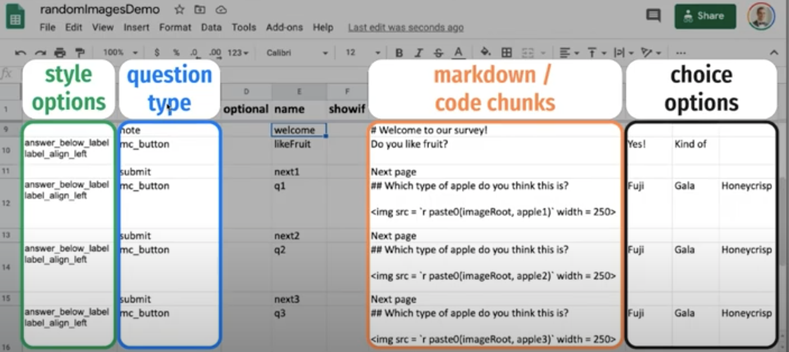
```


.small[https://www.youtube.com/watch?v=_dW7QIjH3tc] 


---

```{r,echo=FALSE,out.width="90%"}
# All defaults
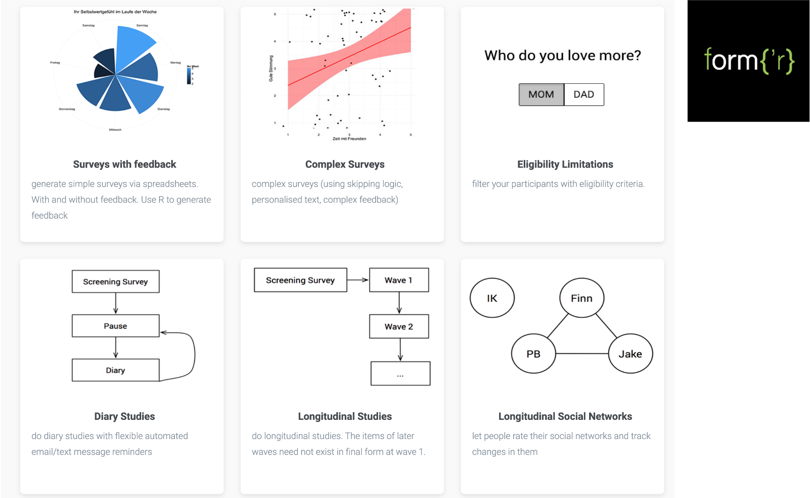
```

.small[https://formr.org] 

---

## Qualitative research

Automated Transcription: [googleLanguageR](https://github.com/ropensci/googleLanguageR)

Qualitative Data Analysis: [RQDA](https://rqda.r-forge.r-project.org/)

Text mining: [tm](https://cran.r-project.org/web/packages/tm/vignettes/tm.pdf), [tidytext](https://cran.r-project.org/web/packages/tidytext/vignettes/tidytext.html)

Semantics analysis: [Latent Semantic Analysis](https://cran.r-project.org/web/packages/lsa/lsa.pdf)

.small[[CRAN Task View: Natural Language Processing](https://cran.r-project.org/web/views/NaturalLanguageProcessing.html)]


---

## Data cleaning 

.pull-left[

The game changing first package with the "Tidy" philosophy- dplyr


```{r,echo=FALSE,out.width="80%"}
# All defaults
knitr::include_graphics("graphics/dplyr.png")
```
]

.pull-right[

Non-Tidy data cleaning code  


```{r,eval=FALSE}
cars<-cars[cars$speed>10,]
cars$speed_over20<-cars$speed>20
```


Non-Tidy data cleaning code  


```{r,eval=FALSE}
cars<-cars %>% 
  filter(speed>10) %>% 
  mutate(speed_over20=speed>20)
```

]

---

class: center, middle

.flex[
.w-70.center[

## .green["Tidy" philosophy]
<br>
To facilitate a .green[conversation] between a .green[human] and a .green[computer] about data. Less abstractly, implement a high-level design philosophy and low-level grammar and data structures .green[across a range of packages], so that learning one package makes it easier to learn the next.
]

.w-20.center[


```{r,echo=FALSE,out.width="80%",,fig.align="center"}
# All defaults
knitr::include_graphics("graphics/HW.jpeg")
```

### .green[Hadley Wickham]
[`r fa("github")`](https://github.com/hadley) [`r fa("twitter")`](https://twitter.com/hadleywickham)
]
]
---

## Study monitoring 


```{r,echo=FALSE,out.width="80%"}
# All defaults
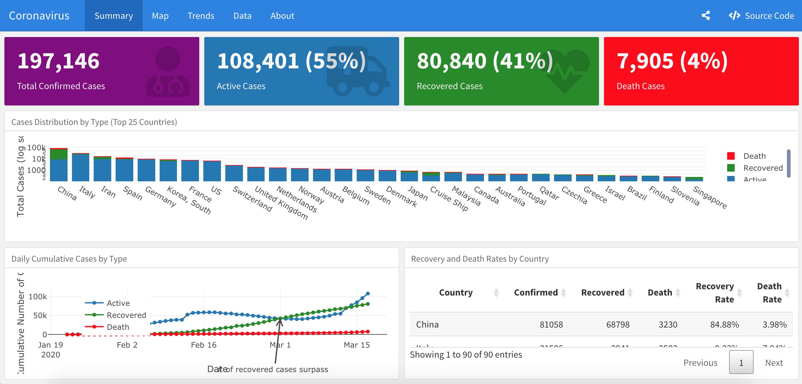
```

.small[[flexdashboard](https://pkgs.rstudio.com/flexdashboard/)]   


---

.small[
```{r}
library(palmerpenguins)
library(reactable)
penguins %>% 
  reactable( filterable = TRUE, 
          compact    = TRUE, # for minimum row height
          striped    = TRUE, # banded rows
          resizable  = TRUE,
          defaultPageSize = 5)
```

]


---
## Visualisation 

```{r,echo=FALSE,out.width="70%",fig.align="center"}
# All defaults
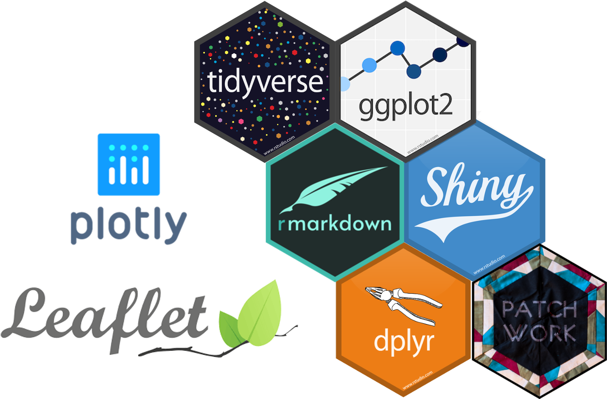
```


---

## BBC style ggplot2

```{r,echo=FALSE,out.width="80%"}
# All defaults
knitr::include_graphics("graphics/ggplot2.png")
```

.small[ [Source](https://bbc.github.io/rcookbook/)]
---

<iframe src="https://exts.ggplot2.tidyverse.org/gallery/" width="100%" height="600px"></frame> 
 
---

## Interactive plot 

```{r,echo=FALSE,results="hide",message=FALSE,warning=FALSE}

splom <- penguins %>%
  rename(bl = bill_length_mm,
         bd = bill_depth_mm,
         fl = flipper_length_mm,
         bm = body_mass_g) 
splom <- ggpairs(splom, #<<
                 columns = 3:6, 
                 aes(color = species)) +
  theme(axis.text = element_blank())
```

.font200[.pull-left[

```{r palmer-event2, warning=FALSE,message=FALSE, results='hide'}
library(plotly)
ggplotly(splom, 
         width=500, height=500) %>% 
  highlight(on = "plotly_selected") 
```
]]
.pull-right[

```{r ref.label="palmer-event2", echo=FALSE, warning=FALSE,message=FALSE,}
```

.font_small[Brush to see how selected points are highlighted in all panels.]]


---

## Interactive framework 

 <iframe src="https://quinnasena.shinyapps.io/r_logistic/" width="100%" height="500px"></frame> 


---
## Statistics, Machine Learning  & Simulation

.flex[
.w-50.center[
```{r,echo=FALSE,out.width="90%",fig.align="center"}
# All defaults
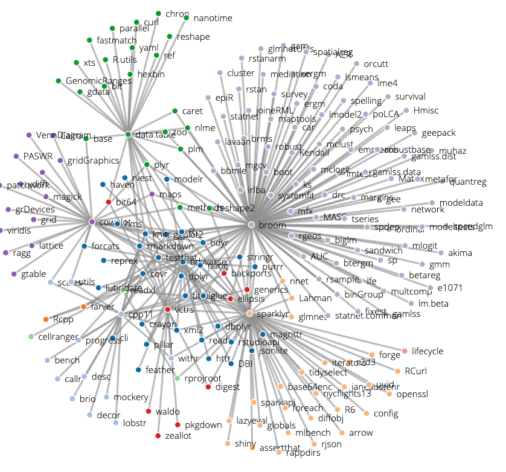
```

]
.w-50[ .small[ 
** .font150[.pink[One-stop-shop ]]**  for a vast majority of statistical, ML and simulation methods.

[CRAN Task Views](https://cran.r-project.org/web/views/)

[Machine Learning & Statistical Learning](https://cran.r-project.org/web/views/MachineLearning.html)

[Survival Analysis](https://cran.r-project.org/web/views/Survival.html)

[Time Series Analysis](https://cran.r-project.org/web/views/TimeSeries.html)

[Meta-Analysis](https://cran.r-project.org/web/views/MetaAnalysis.html)

[Psychometric Models and Methods](https://cran.r-project.org/web/views/Psychometrics.html)

[Multivariate Statistics](https://cran.r-project.org/web/views/Multivariate.html)

[Cluster Analysis & Finite Mixture Models](https://cran.r-project.org/web/views/Cluster.html)

]]]


---


.flex[
.w-50[

## Display results

Staged processes of data cleaning, analysis and gathering results are outdated 

Reproducibility and transparency have brought in new regimes for integrated framework 

New system - Rmarkdown workflow 
]


.w-50.center[

{{content}}
]
]

--

```{r,echo=FALSE,out.width="80%",fig.align="center"}
# All defaults
knitr::include_graphics("graphics/rmarkdown_workflow.png")
```


---
class: inverse


## R markdown 


Make your analysis easily reproducible 

Results interactive 

Easier with formatting 


[Example](https://carolinexgao.github.io/MBS_COVID/Analysis_COVID.html)

---

## Interactive with word 

<iframe src="https://ardata-fr.github.io/officeverse/index.html" width="100%" height="500px"></frame> 

---
##  Write a paper 
.flex[
.w-50[
```{r,echo=FALSE,out.width="100%"}
# All defaults
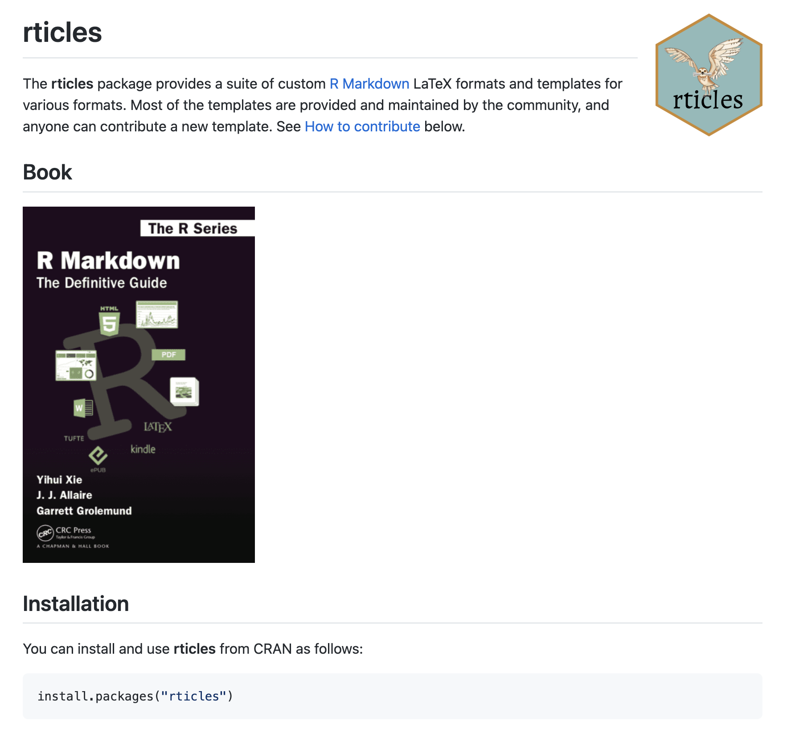
```
] 

.w-50.center[

{{content}}
]
]

--


```{r,echo=FALSE,out.width="100%",fig.align="center"}
# All defaults
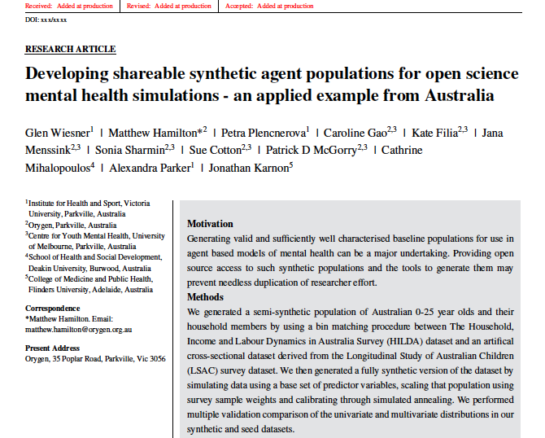
```

---
## Make a poster 


```{r,echo=FALSE,out.width="70%",fig.align="center"}
# All defaults
knitr::include_graphics("https://github.com/brentthorne/posterdown/blob/master/images/example_poster1.png?raw=true")
```


---

## Write a book 


 <iframe src="https://bookdown.org/" width="100%" height="500px"></frame> 


---

class: inverse

## Presentation slides
--

Hope you like this example generated using xaringan


---
## Share and collaborate with the community 

--

.flex[
.w-55.center[


]

.w-45.center[


]
]


---

## Design a logo 

```{r,fig.height=4,fig.width=8}
library(hexSticker)

s<-sticker(here::here("graphics/Logo.jpg"), package="", p_size=0, s_x=1, s_y=1,
        s_width=.65,  h_fill="white",h_size=2,
        filename="inst/figures/imgfile.png")
s
```

---

## Build a website 


 <iframe src="https://robjhyndman.com/" width="100%" height="500px"></frame> 
 
 
---

Popular packages [glogdown]("https://shilaan.rbind.io/post/building-your-website-using-r-blogdown") and [distill]("https://www.andreashandel.com/posts/distill-github-website")

<iframe src="https://emitanaka.org/" width="100%" height="500px"></frame> 
 
---

.flex[
.w-90[
## Working with social media data 

```{r,eval=FALSE}
library(rtweet)
## search for 10000 tweets using the rstats hashtag
rt <- search_tweets(
  "#rstats", n = 10000, include_rts = FALSE) %>% 
  ts_plot() +
  theme_classic()
```

```{r,echo=FALSE,out.width="50%"}
# All defaults
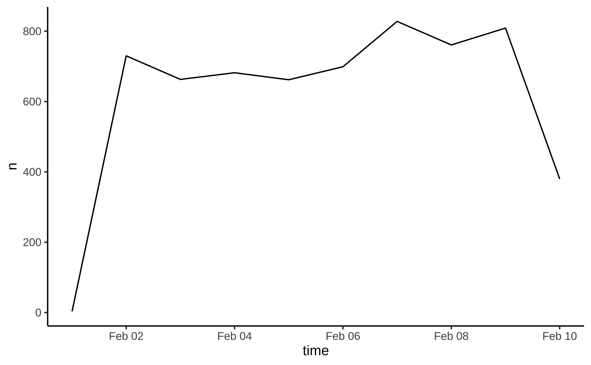
```


]

.w-10.center[


]
]

---

## Web scraping  


 <iframe src="https://en.wikipedia.org/w/index.php?title=The_Lego_Movie&oldid=998422565" width="100%" height="500px"></frame> 

---


.flex[
.w-90[

.small[
```{r,warning=FALSE,message=FALSE}
library(rvest)
table<-read_html("https://en.wikipedia.org/w/index.php?title=The_Lego_Movie&oldid=998422565") %>% 
  html_element(".tracklist") %>% 
  html_table()
table%>% 
  reactable( filterable = TRUE, 
          compact    = TRUE, # for minimum row height
          striped    = TRUE, # banded rows
          resizable  = TRUE,
          defaultPageSize = 4)
```
]
]

.w-10.center[


]]

---
## The process integration: Tidy-flow


```{r,echo=FALSE,out.width="70%",fig.align="center"}
# All defaults
knitr::include_graphics("graphics/tidyv-flow.png")
```


---

class: inverse

## Conclusion 

--

R has become a research tool beyond it's statistical and computational ability

--

There is a step learning curvy, but a large supportive community 

--

R encourages collaborative, reproducible, interactive and creative research

--


.purple[So Use R]

